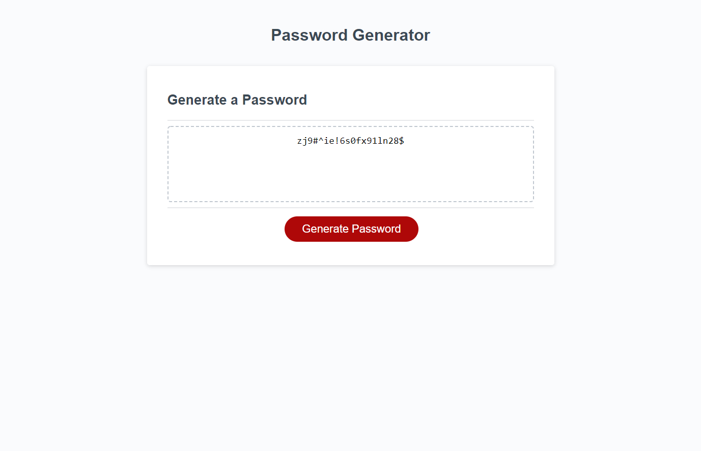

<h1>Challenge 3: Password Generator <h2>
 
 <h2>Site URL:</h2>
 https://nickus1028.github.io/Generate-a-password/
 
 <h2>Screenshot<h2>
 </img>
   
 <h2>Summary</h2>
   
  <ul>
    <li>Created function to generate password.</li>
    <li>Used windows prompts to gather password requirements.</li>
    <li>Based on requirements, adjusted length and need of uppercase, lowercase, numbers or special characters available.</li>
    <li>Returned generated passcode for the user to use.</li>
   </ul>
